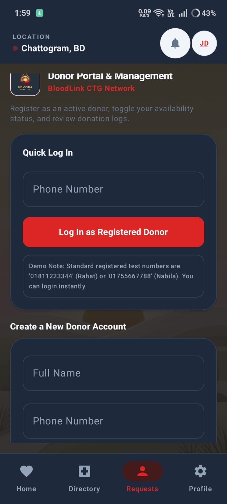
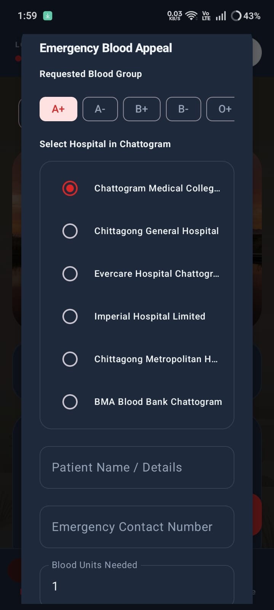

# CTG Blood Link

## Blood Donation Management App

CTG Blood Link is an Android application that helps connect blood donors and recipients in Chattogram.

### Features
- Donor Registration
- Blood Request
- Search Blood Donors
- Emergency Contact
- User Friendly Interface

### Developer
Shariar Mahbub

### Technology
- Kotlin
- Android Studio
## App Screenshots

  
  
  

  
  

